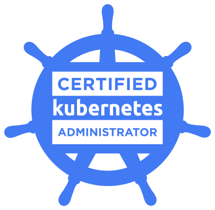

<!-- markdownlint-disable MD033 -->
<figure markdown="span">
  { width="300" }
</figure>

---

## [Domains & Competencies](https://training.linuxfoundation.org/certification/certified-kubernetes-administrator-cka/){:target="_blank"}

| Topic                                                 | Weightage (%) |
|-------------------------------------------------------|---------------|
| Cluster Architecture, Installation & Configuration    | 25            |
| Services & Networking                                 | 20            |
| Troubleshooting                                       | 30            |
| Workloads & Scheduling                                | 15            |
| Storage                                               | 10            |

### 1. Cluster Architecture, Installation & Configuration

- [Manage role based access control (RBAC)](https://kubernetes.io/docs/reference/access-authn-authz/rbac/){:target="_blank"}
- [Use Kube-adm to install a basic cluster](https://kubernetes.io/docs/setup/production-environment/tools/kubeadm/install-kubeadm/){:target="_blank"}
- [Manage a highly-available Kubernetes cluster](https://kubernetes.io/docs/setup/production-environment/tools/kubeadm/high-availability/){:target="_blank"}
- [Provision underlying infrastructure to deploy a Kubernetes cluster](https://kubernetes.io/docs/tasks/tools/install-kubectl/){:target="_blank"}
- [Perform a version upgrade on a Kubernetes cluster using Kubeadm](https://kubernetes.io/docs/tasks/administer-cluster/kubeadm/kubeadm-upgrade/){:target="_blank"}
- [Implement etcd backup and restore](https://kubernetes.io/docs/tasks/administer-cluster/configure-upgrade-etcd/#backing-up-an-etcd-cluster){:target="_blank"}

### 2. Services & Networking  

- [Understand host networking configuration on the cluster nodes](https://kubernetes.io/docs/concepts/cluster-administration/networking/){:target="_blank"}
- [Understand connectivity between Pods](https://kubernetes.io/docs/concepts/cluster-administration/networking/){:target="_blank"}
- [Understand ClusterIP, NodePort, LoadBalancer service types and endpoints](https://kubernetes.io/docs/concepts/services-networking/service/){:target="_blank"}
- [Know how to use Ingress controllers and Ingress resources](https://kubernetes.io/docs/concepts/services-networking/ingress/){:target="_blank"}
- [Know how to configure and use CoreDNS](https://kubernetes.io/docs/concepts/services-networking/dns-pod-service/){:target="_blank"}
- [Choose an appropriate container network interface plugin](https://kubernetes.io/docs/concepts/extend-kubernetes/compute-storage-net/network-plugins/){:target="_blank"}

### 3. Troubleshooting  

- [Understand how to monitor applications](https://kubernetes.io/docs/concepts/cluster-administration/logging/){:target="_blank"}
- [Manage container stdout & stderr logs](https://kubernetes.io/docs/concepts/cluster-administration/logging/){:target="_blank"}
- [Troubleshoot application failure](https://kubernetes.io/docs/tasks/debug-application-cluster/debug-application/){:target="_blank"}
- [Troubleshoot cluster component failure](https://kubernetes.io/docs/tasks/debug-application-cluster/debug-cluster/){:target="_blank"}
- [Troubleshoot networking](https://kubernetes.io/docs/concepts/cluster-administration/networking/){:target="_blank"}

### 4. Workloads & Scheduling  

- [Understand deployments and how to perform rolling update and rollbacks](https://kubernetes.io/docs/concepts/workloads/controllers/deployment/#rolling-back-a-deployment){:target="_blank"}
- [Use ConfigMaps and Secrets to configure applications](https://kubernetes.io/docs/tasks/configure-pod-container/configure-pod-configmap){:target="_blank"}
- [Know how to scale applications](https://kubernetes.io/docs/concepts/workloads/controllers/deployment/#scaling-a-deployment){:target="_blank"}
- [Understand the primitives used to create robust, self-healing, application deployments](https://kubernetes.io/docs/concepts/workloads/controllers/deployment/#use-case){:target="_blank"}
- [Understand how resource limits can affect Pod scheduling](https://kubernetes.io/docs/concepts/configuration/manage-resources-containers/){:target="_blank"}
- [Awareness of manifest management and common templating tools](https://kubernetes.io/docs/tasks/manage-kubernetes-objects/declarative-config/){:target="_blank"}

### 5. Storage  

- [Understand storage classes, persistent volumes](https://kubernetes.io/docs/concepts/storage/persistent-volumes/#persistent-volumes){:target="_blank"}
- [Understand volume mode, access modes and reclaim policies for volumes](https://kubernetes.io/docs/tasks/administer-cluster/change-pv-reclaim-policy/){:target="_blank"}
- [Understand persistent volume claims primitive](https://kubernetes.io/docs/concepts/storage/persistent-volumes/#persistentvolumeclaims){:target="_blank"}
- [Know how to configure applications with persistent storage](https://kubernetes.io/docs/tasks/configure-pod-container/configure-persistent-volume-storage/#create-a-persistentvolumeclaim){:target="_blank"}
