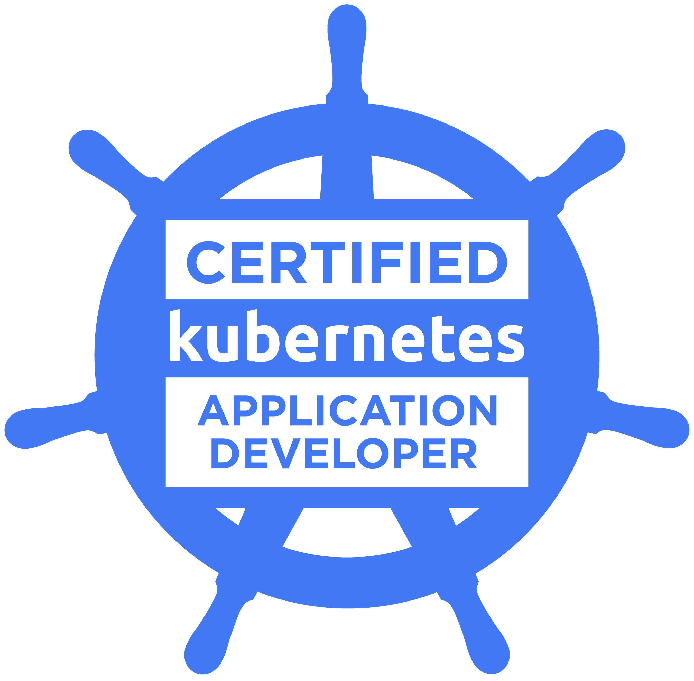

<!-- markdownlint-disable MD033 -->
<figure markdown="span">
  { width="300" }
</figure>

---

#### Overview

Kubernetes authentication and authorization are critical for securing access to the Kubernetes API and ensuring that users and services have the correct permissions to perform actions.

!!! info "Documentation"
    [Kubernetes Authentication and Authorization](https://kubernetes.io/docs/reference/access-authn-authz/){:target="_blank"}.

---

#### Authentication Methods

- **Normal Users**: Usually authenticate using client certificates. They are typically managed by an external, independent service.
- **ServiceAccounts**: Use tokens for authentication, which are automatically managed by Kubernetes.

---

#### Authorization with RBAC

Role-Based Access Control (RBAC) is used in Kubernetes to manage authorization. It involves defining roles and binding them to users or ServiceAccounts.

1. **Roles and ClusterRoles**

    A `Role` defines a set of permissions within a specific namespace.

    A `ClusterRole` defines permissions that are applicable across the entire cluster.

2. **RoleBindings and ClusterRoleBindings**

    A `RoleBinding` grants the permissions defined in a Role to a user or set of users within a specific namespace.

    A `ClusterRoleBinding` grants the permissions defined in a ClusterRole across the entire cluster.

---

#### Steps to Configure RBAC for Kubernetes Auth

1. **Define Roles or ClusterRoles**

    Create a Role or ClusterRole to specify permissions.

    ```yaml title="Example for a Role"
    apiVersion: rbac.authorization.k8s.io/v1
    kind: Role
    metadata:
      name: pod-reader
    rules:
      - apiGroups: [""]
        resources: ["pods"]
        verbs: ["get", "watch", "list"]
    ```

2. **Bind Roles to Users/ServiceAccounts**

      Use a RoleBinding or ClusterRoleBinding to grant these permissions to users or ServiceAccounts.

      ```yaml title="Example for a RoleBinding"
      apiVersion: rbac.authorization.k8s.io/v1
      kind: RoleBinding
      metadata:
        name: read-pods
      subjects:
        - kind: User
          name: jane
          apiGroup: rbac.authorization.k8s.io
      roleRef:
        kind: Role
        name: pod-reader
        apiGroup: rbac.authorization.k8s.io
      ```

3. **Apply the Configuration**

    Use `kubectl apply` to create these roles and bindings in the Kubernetes cluster.

4. **Verify Permissions**

    Verify that the users or ServiceAccounts have the appropriate permissions as defined by the roles and bindings.

---

#### Conclusion

Understanding and correctly implementing Kubernetes authentication and authorization are essential for maintaining the security and proper functioning of a Kubernetes cluster. RBAC provides a flexible and powerful way to control access to resources in Kubernetes, allowing administrators to precisely define and manage who can do what within the cluster.

---
