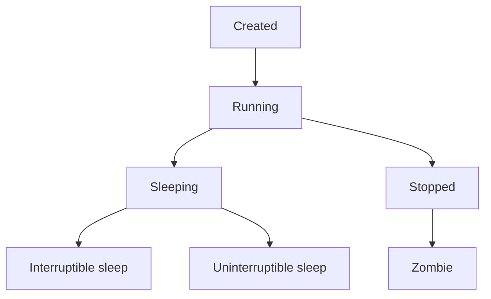

## Introduction

In Linux, a process is simply a program that is currently running. When you execute a command, it starts a process.

1. Processes can be categorized into `Foreground Processes`, which require user input and run in the foreground.
2. `Background processes`, which run independently of the user.

Understanding processes is essential for managing and interacting with programs effectively in Linux.

---

## Process States

A process state refers to the current condition or status of a process in its execution lifecycle

Describing various attributes of a process:

| Attribute | Description                                                         |
|-----------|---------------------------------------------------------------------|
| PID       | Unique Process ID given to each process.                           |
| User      | Username of the process owner.                                     |
| PR        | Priority given to a process while scheduling.                       |
| NI        | 'nice' value of a process.                                         |
| VIRT      | Amount of virtual memory used by a process.                        |
| RES       | Amount of physical memory used by a process.                       |
| SHR       | Amount of memory shared with other processes.                      |
| S         | State of the process: 'D' = uninterruptible sleep, 'R' = running, 'S' = sleeping, 'T' = traced or stopped, 'Z' = zombie. |
| %CPU      | Percentage of CPU used by the process.                             |
| %MEM      | Percentage of RAM used by the process.                             |
| TIME+     | Total CPU time consumed by the process.                            |
| Command   | Command used to activate the process.                              |

---
