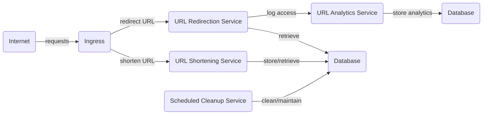

!!! danger "In Development"
    URLify Hub is currently under active development and not yet available for public use. Stay tuned for updates!

The URL Shortener project employs a microservices architecture to efficiently manage and redirect URLs. It integrates URL processing, analytics, and database services, ensuring high scalability and performance for web applications.

## Microservices Architecture

---

## Architecture Overview

- **Internet**: Entry point for user requests.
- **Ingress**: Routes requests to either the URL Shortening Service or the URL Redirection Service.
- **URL Shortening Service**: Handles creation of shortened URLs.
- **URL Redirection Service**: Manages redirection to original URLs and logs access data.
- **Database for URL Service**: Stores data for shortened and original URLs.
- **URL Analytics Service**: Processes access logs from the URL Redirection Service.
- **Database for Analytics Service**: Stores analytical data processed by the URL Analytics Service.
- **Scheduled Cleanup Service**: Runs maintenance tasks on the URL service database.

---
