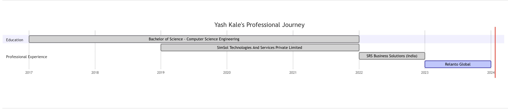

# Career Timeline

---

This timeline illustrates my educational background and professional journey, uniquely intertwined due to the shift to online modes during the COVID-19 pandemic. This period allowed me to simultaneously pursue my education and gain valuable work experience.

{ loading=lazy }

!!! warning ""
    Click on the image for an enlarged pop-up view; close it by clicking the upper right cross button.

!!! note ""
    I started college in 2017 and completed two years.
    However, due to a backlog, I took a gap year. During this time,
    I started working at SimSol Technologies in 2019 to make the most of my year off.
    When the pandemic began, it allowed me to continue working while also completing my education online. I finished my degree in 2022.
    After graduating, I joined SRS Business Solutions,
    and later, I transitioned to working at Relanto Global.

## Education

- **BE - Computer Science Engineering (2017 - 2022):** Completed my degree with a focus on Computer Science Engineering. The transition to online learning during the pandemic allowed me to simultaneously engage in professional work.

## Professional Experience

- **[SimSol Technologies And Services Private Limited (2019 - 2022):](https://www.simsol.in){:target="_blank"}** Began my professional career here. The flexible, remote work environment during the pandemic enabled me to balance this role with my ongoing studies.

- **[SRS Business Solutions (India) (2022 - 2023):](https://www.srsconsultinginc.com/index){:target="_blank"}** Continued to expand my software engineering skills, working on diverse projects.
!!! danger ""
    ⚠️ In 2023, I was transferred from SRS Business Solutions to Relanto Global based on a company decision. This was not a personal job switch but a transfer initiated by the company, as confirmed by a transfer letter from SRS.

- **[Relanto Global (2023 - 2024):](https://www.relanto.ai){:target="_blank"}** Enhancing my professional expertise, contributing to innovative software solutions.

- **[Arkose Labs (2024 - Present):](https://www.arkoselabs.com){:target="_blank"}**
Currently working as a Site Reliability Engineer

---

*Thank you for taking the time to read this.*

---
